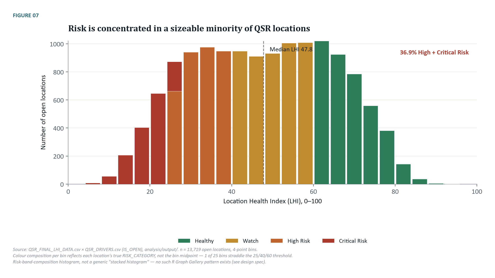
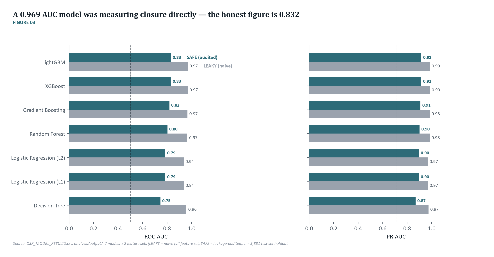

# QSR Location Health Index

An individual project: a digital-health scorecard for quick-service restaurant (QSR)
locations, built from the [Yelp Open Dataset](https://business.yelp.com/data/resources/open-dataset/).
Scores 19,154 locations across four pillars (peer standing, engagement, momentum, and
customer experience), flags at-risk outlets, and explains *why* each score is what it is.

I designed and built this — the exploratory analysis, the NLP-based aspect-level sentiment
model, the Location Health Index scoring pipeline, and the interactive HTML operator's
dashboard — over a 6-week employer-project engagement with **VP Analytics**, delivered
through the LSE Data Analytics Career Accelerator.



## Approach

The pipeline runs as thirteen independent, re-runnable stages: data quality audit, review
extraction, exploratory analysis, aspect-based sentiment scoring, peer benchmarking,
trajectory analysis, a leakage audit, ML modelling, four candidate index constructions,
a robustness grid, explainability, confidence/fallback handling, and final export.

**Peer benchmarking.** Every location is compared only to same-segment competitors,
starting within a 10-mile radius and falling back to city, then state, then a global
segment comparison when local competition is too thin. The median location has 119
comparable peers.

**Aspect-based sentiment.** Reviews are read for seven operational aspects — food,
service, staff, cleanliness, wait time, order accuracy, and value — using a transparent,
rule-based sentiment model rather than a black-box one, specifically so every scoring
decision can be inspected and challenged. All seven aspects move in the expected direction
with star rating, despite never seeing the rating during scoring.

**The Location Health Index.** Four pillars combine into one 0–100 score: peer standing,
engagement, momentum, and customer experience. The final weighting blends three
independently-built candidates — a business-judgement baseline, a statistics-driven
weighting, and a model-driven weighting — into one hybrid construction, then stress-tests
that construction against five deliberately different alternative weightings. Agreement
with the selected version stays at 0.95 Spearman correlation or higher in every case.



**Validating the modelling honestly.** An early version of the underlying classifier
looked 97% accurate at predicting open-vs-closed status — until a leakage audit showed it
was just detecting review recency, not health, because a closed business trivially stops
generating new reviews. The corrected, leakage-audited model (0.832 ROC-AUC) is the one
this project actually trusts.

## Key findings

- Aggregate rankings are stable across reasonable alternative weightings, but individual
  locations near a threshold are not — 38.4% of locations move by more than 15% of the
  population's rank depending on the exact weighting used. A "top 100 at-risk" shortlist
  is a policy choice, not a fixed fact about the portfolio.
- 36.9% of open locations are currently rated High or Critical Risk.
- Most locations (about 4 in 5) don't yet have enough review history to support a
  statistically defensible trend either way — the index reports "insufficient evidence"
  rather than forcing a direction onto thin data.
- The index is a read of digital-signal health, not a certified measure of operational
  performance — there's no sales, closure, or audit data in this dataset to validate that
  stronger claim against.

## Repository structure

```
notebook/       End-to-end analysis notebook (EDA, NLP, scoring, validation)
dashboard/      Self-contained interactive HTML dashboard + its build scripts
figures/        Final chart assets from the analysis
src/            Pipeline source: analysis/ (13-stage scoring pipeline) and
                chart_pack_lib/ (chart generation scripts)
about/          Individual reflection documenting my role on the wider project
requirements.txt
```

## Running it

The dashboard (`dashboard/QSR_Location_Health_Dashboard.html`) is fully self-contained —
open it directly in a browser, no server required.

The analysis pipeline (`src/analysis/`) runs as thirteen independent, re-runnable stages
(`01_data_quality_audit.py` through `13_final_export.py`). Install dependencies with:

```bash
pip install -r requirements.txt
```

**Data.** The underlying business and review data lives in Snowflake, loaded and prepared
there before Python took over for feature engineering, modelling, and scoring. Raw CSV
exports are not included in this repository — partly for data integrity (Snowflake is the
single source of truth the pipeline was built against, not a static file that can drift),
and partly because the Yelp Open Dataset's own licence doesn't permit redistributing the
raw data, and the review data is real user-generated content tied to real Yelp accounts.
The underlying exports can be produced on request; anyone wanting to run the pipeline
independently should download the dataset directly from Yelp,
[here](https://business.yelp.com/data/resources/open-dataset/), under their own agreement
to its terms.

## Key numbers

| | |
|---|---|
| Locations scored | 19,154 (13,719 open) |
| Reviews analysed | 1.16M |
| Leakage-audited model accuracy | 0.832 ROC-AUC |
| Rank stability across 5 alternative weightings | ≥ 0.95 Spearman correlation |
| Project duration | 6 weeks |

## Notes

- No claim in this project describes current operating conditions — the underlying data
  is a historical snapshot through 19 January 2022.
- `about/Individual_Reflection.pdf` is my own account of this project, written for the
  course, documenting my specific role and contributions.
